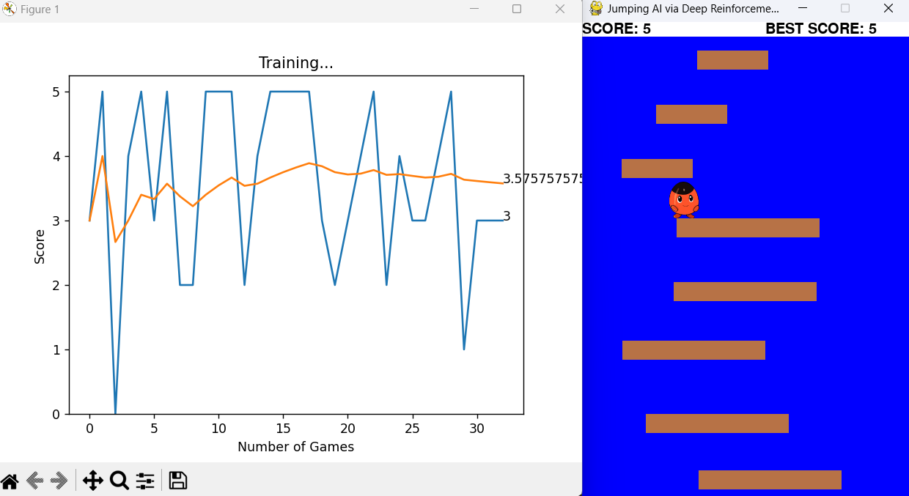

# DRL_python_jumping_game

The Deep Reinforcement Learning Algorithm is used to evolve an AI to jump on platforms.

The repository contains the following files:

`agent.py` : To run the game played using Deep Reinforcement Learning algorithm. Contains the code of the RL agent

`gameHuman.py` : to play the game using user input (left and right arrow for movement and up arrow to jump)

`model.py` : The Neural Network Algorithm used for RL.

`game.py` :  The game logic and code.

`settings.py` : Game settings

`sprites.py` : Game sprites classes (player and platform)

`helper.py` : Visualization of the improvement using a graph

  

